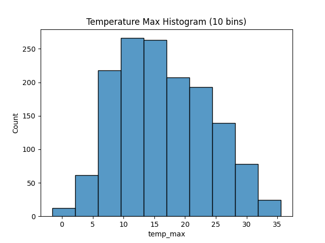
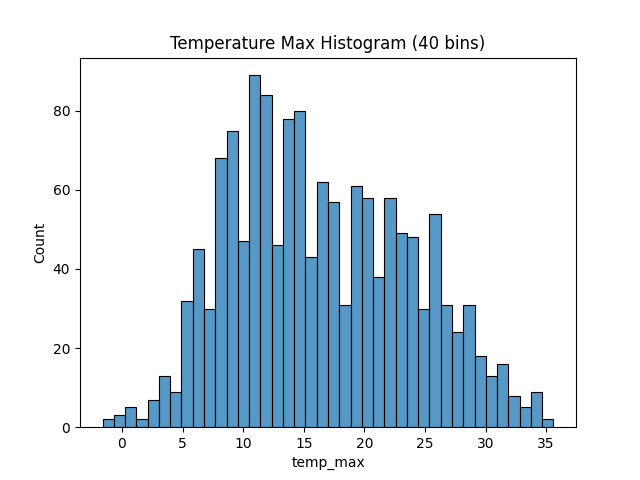
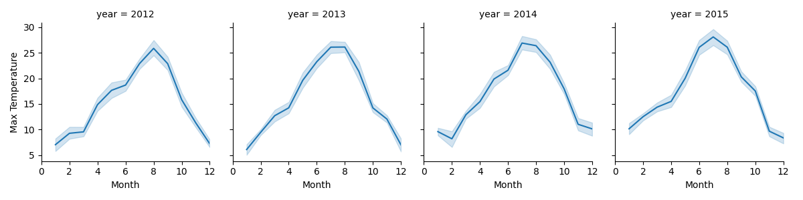
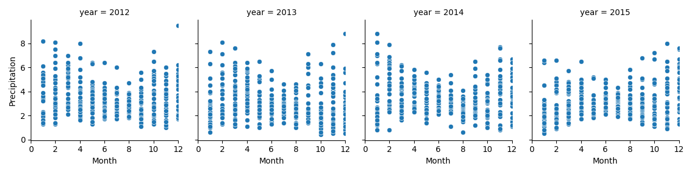
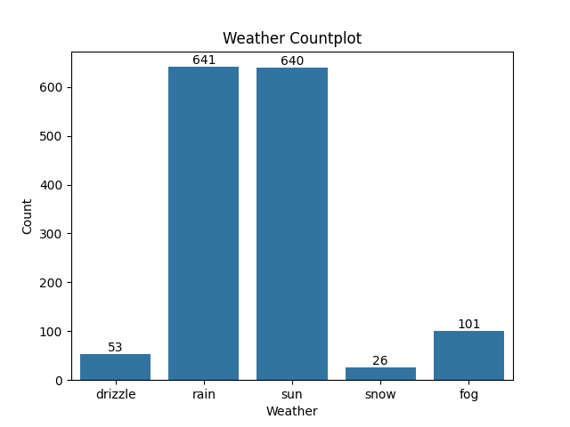
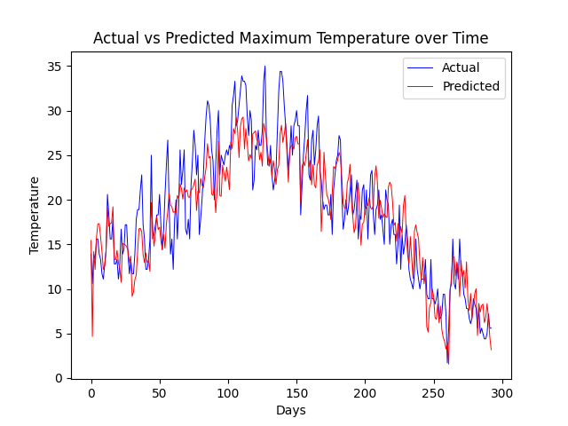
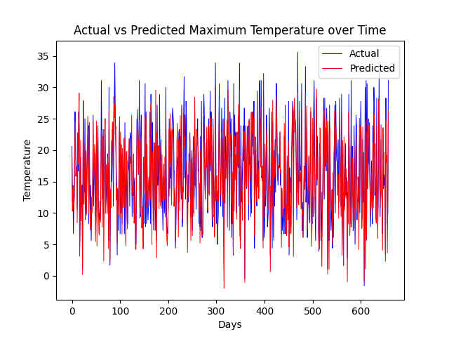
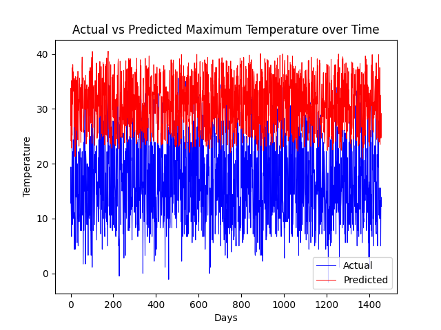
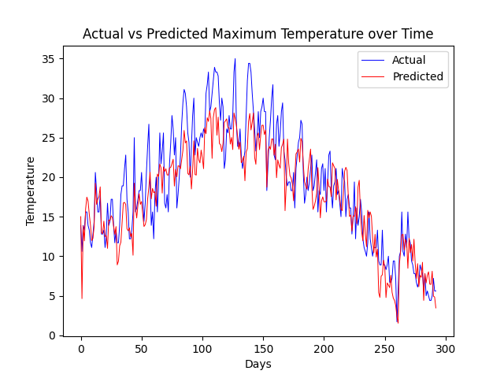

# Part 1 - Numerical Dataset Analysis

Opening up the CSV, the first thing that we can see is that we have the following columns: *Date*, *Precipitation*, *Temp Max*, *Temp Min*, *Wind*, *Weather*

Another thing that is visible right off the bat is that the given data is collected from a span of **4 years** (2012 - 2015)

Moving forward, when we run the `pd.DataFrame.info(dataframe)` command we are presented with the following output:

```
RangeIndex: 1461 entries, 0 to 1460
Data columns (total 6 columns):
 #   Column         Non-Null Count  Dtype  
---  ------         --------------  -----  
 0   date           1461 non-null   object 
 1   precipitation  1461 non-null   float64
 2   temp_max       1461 non-null   float64
 3   temp_min       1461 non-null   float64
 4   wind           1461 non-null   float64
 5   weather        1461 non-null   object 
dtypes: float64(4), object(2)
memory usage: 68.6+ KB
```

This is important because it highlights the following aspects of the data:
- 1461 entries corresponds to every day in a 4-year period (therefore as long as no duplicate data is present, every day is accounted for)
- each column has a count of how many non-null entries it has, and it's data type
- Apart from date (which stores dates) and weather (which stores strings), the rest of the columns store numerical data

Our dataset_info function was also built to check for duplicate data and also to print the most common weather condition. Thus, the following lines represent valuable info into the data provided

```
Duplicate rows:
None
Most common weather: rain (641 days)
```

Finally, after checking there are no duplicates, we know each day is accounted for. Also, we know that the most common weather was rain (being present in 641 days)

# Part 2 - Plotted Dataset Analysis

After a strictly numerical analysis, we turn to plots, and check data trends.

First things first we analyse a histogram of max temperatures to check how common it was during the given 4 years to reach each one.




We have varied the number of bins to get a better grasp of the difference between a broader range of temperatures and a narrower one.

We could use the broader range (10 bins) and compare it to certain climates and figure out in which climate we are most likely in.

For example, the high amount of days between 5-25 degrees shows that it is an average temperature that **most likely** changes throughout the year, placing this country in a **temperate climate** (however, for precision a monthly temperature chart would be better)

The stricter range gives us a closer look at which temperatures are most common since each bucket represents a degree.



Now that we can also see the monthly lineplot for each year's max temperature, we can see the similarity to the **temperate climate** and can more confidently trust our find.

Other than geographical properties, this could also be a good representation of the temperatures you may expect if you were to go on vacation there and plenty of other useful situations.

Next up, we may be interested in visualizing how much it rains in each month (and similarly we are provided with 4 graphs, one for each year)



Once again, we can use it both for geographical properties and personal endeavours and curiosities.

What is particularly interesting to me about this graph is that visually, a correlation between rising temperatures and lower precipitation is apparent (the inverse as well, lower temperatures <=> more rain)

Finally, we can also see which type of weather was most common throughout the 4 years we have data for:




The countplot is particularly useful at seeing a number of times for which that weather happened, while the piechart shows the percentage of time it happened.

# Part 3 - Weather Prediction

When it comes to predictions, there are a few things I've noticed while playing around.

## Linear Regression with Default split (80% train, 20% test)

The predictions were quite close to reality to the point where the worst error would be at most a couple of degrees, no particularly bad guesses.

The first time around I ignored weather just to get the linear regression to work (strings are not numbers, what a surprise!)

These are the results:

```
Mean Squared Error: 11.07220640293206
r2 score: 0.7978053155720439
```



Now after I got the regression to work, I turned the weather to numerical data (a simple association between weather and a number) and the result were better, however not noticeably better:

```
Mean Squared Error: 10.722358570486234
r2 score: 0.8041940487210625
```


## Linear Regression with Random splits

This time around, when we attempt unorthodox splits, we can see why the previous values were sacred.

As long as there is a sizeable amount of training data the errors aren't that bad:

```
train_split: 0.5499464158218942
test_split: 0.4500535841781058
Mean Squared Error: 10.89650318995168
r2 score: 0.7945382707024315
```



However, an insane split (0.2% training and 99.8% testing) will yield...... insane results (who would've thought):

```
train_split: 0.0020383326075384955
test_split: 0.9979616673924615
Mean Squared Error: 282.4319822424254
r2 score: -4.248233600418152
```



## SVR with default split

Personally, with the limited interaction I've had with this regression, I cannot see much of a difference since the predictions are more or less the same.

```
Mean Squared Error: 11.772992559129934
r2 score: 0.7850079353076742
```

