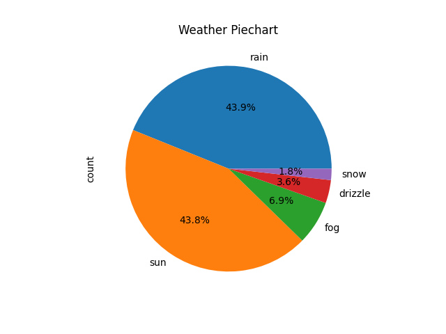

# Part 1 - Numerical Dataset Analysis

Opening up the CSV, the first thing that we can see is that we have the following columns: *Date*, *Precipitation*, *Temp Max*, *Temp Min*, *Wind*, *Weather*

Another thing that is visible right off the bat is that the given data is collected from a span of **4 years** (2012 - 2015)

Moving forward, when we run the `pd.DataFrame.info(dataframe)` command we are presented with the following output:

```
RangeIndex: 1461 entries, 0 to 1460
Data columns (total 6 columns):
 #   Column         Non-Null Count  Dtype  
---  ------         --------------  -----  
 0   date           1461 non-null   object 
 1   precipitation  1461 non-null   float64
 2   temp_max       1461 non-null   float64
 3   temp_min       1461 non-null   float64
 4   wind           1461 non-null   float64
 5   weather        1461 non-null   object 
dtypes: float64(4), object(2)
memory usage: 68.6+ KB
```

This is important because it highlights the following aspects of the data:
- 1461 entries corresponds to every day in a 4-year period (therefore as long as no duplicate data is present, every day is accounted for)
- each column has a count of how many non-null entries it has, and it's data type
- Apart from date (which stores dates) and weather (which stores strings), the rest of the columns store numerical data

Our dataset_info function was also built to check for duplicate data and also to print the most common weather condition. Thus, the following lines represent valuable info into the data provided

```
Duplicate rows:
None
Most common weather: rain (641 days)
```

Finally, after checking there are no duplicates, we know each day is accounted for. Also, we know that the most common weather was rain (being present in 641 days)

# Part 2 - Plotted Dataset Analysis


